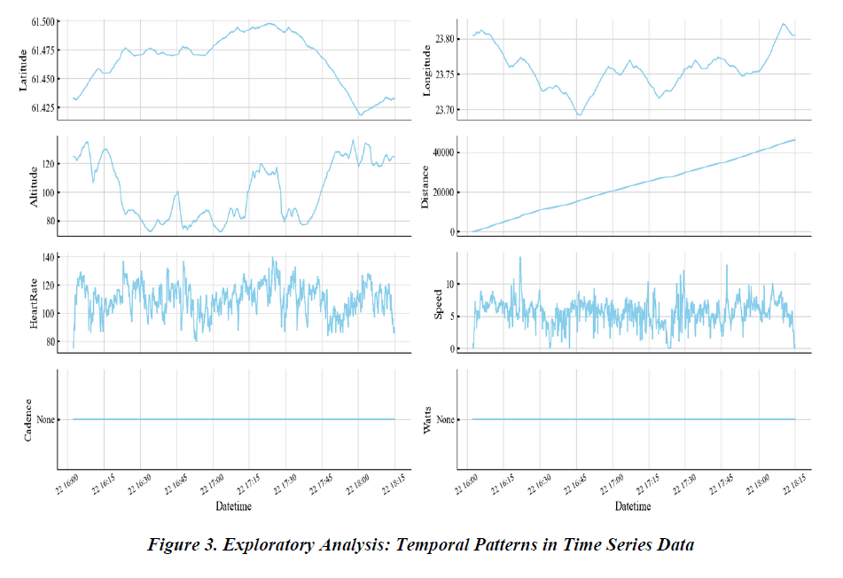
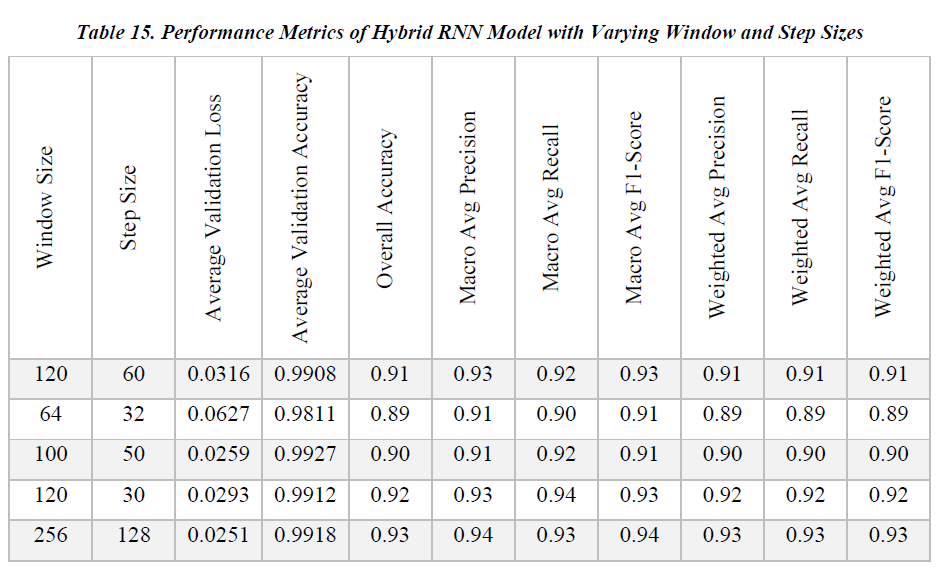
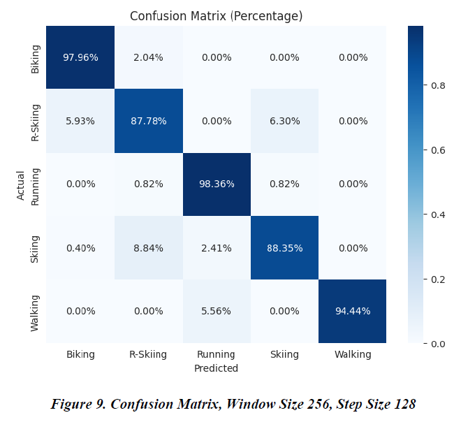

# Neural Networks with Sliding Window Data Augmentation for Time Series Classification

## ⚠️ Intellectual Property Notice
> **Important:** This repository serves as **technical documentation** for my Master's Thesis conducted at **Ural Federal University**. Due to strict Intellectual Property (IP) regulations regarding the proprietary dataset and source code, the raw code cannot be shared publicly. This documentation outlines the methodology, system architecture, and experimental results to demonstrate technical proficiency.

---

## 📌 Project Overview

### The Challenge
With the rapid proliferation of smartwatches and wearables (like Garmin and Apple Watch), **Human Activity Recognition (HAR)** has become a critical feature. However, traditional methods often rely on users manually selecting their sport profiles, which leads to frequent misclassification and erroneous data statistics. 
*The core challenge was:* How to accurately classify diverse outdoor activities (e.g., Biking vs. Roller Skiing) using raw sensor data, especially when training data is limited or imbalanced?

### The Solution (Abstract)
This research proposes a robust Deep Learning approach using **Recurrent Neural Networks (RNNs)** combined with **Sliding Window Data Augmentation**. 

By designing and evaluating multiple architectures (**LSTM, SimpleRNN, GRU, and Hybrid RNN**), the study demonstrates that:
1.  **Data Augmentation** (Sliding Window technique) significantly enhances model generalization and robustness.
2.  A novel **Hybrid RNN architecture** outperforms standard models in handling multivariate time-series data.
3.  Optimization of window sizes (256) and step sizes is critical for identifying complex movement patterns.

---

## 🛠️ Methodology & Workflow
The system processes multivariate time-series data (Heart Rate, Speed, Altitude) through a specific pipeline: **Preprocessing -> Segmentation -> Augmentation -> Neural Network Classification**.

### System Architecture
The diagram below illustrates the end-to-end workflow, from raw data loading to the final classification prediction.

 
*(Figure 5: Illustrative overview of loading, pre-processing, and window segmentation)*

---

## 📊 Data Analysis
The dataset comprises multivariate time series of 228 outdoor sport activities. Exploratory Data Analysis (EDA) was conducted to understand temporal patterns in features like Altitude, Heart Rate, and Speed.

*(Figure 3: Exploratory Analysis of Temporal Patterns)*

---

## 🧠 Model Architecture (Hybrid RNN)
The best-performing model utilized a **Hybrid Approach** designed to capture both short-term and long-term dependencies:
1.  **Input Layer:** Handles multivariate sequences.
2.  **Recurrent Layers:** A combination of **SimpleRNN**, **GRU**, and **LSTM** layers running in parallel or sequence to extract complex temporal features.
3.  **Concatenation:** Merging features from different recurrent units.
4.  **Regularization:** Utilized **Dropout** and **Batch Normalization** to prevent overfitting.
5.  **Output:** Softmax classification for 5 distinct activities.

---

## 📈 Experimental Results
Extensive testing was conducted to optimize the **Window Size** and **Step Size**. The **Hybrid RNN** model with a window size of **256** and step size of **128** yielded the best results, outperforming baseline models.

### Key Metrics
*   **Overall Accuracy:** **93%**
*   **Macro F1-Score:** **0.94**
*   **Validation Loss:** 0.0251

### Performance Table
The table below details the performance metrics across different window/step configurations.

*(Table 15: Performance Metrics of Hybrid RNN Model with Varying Window and Step Sizes)*

### Confusion Matrix
The model showed exceptional accuracy in distinguishing between complex and similar activities (e.g., distinguishing "Running" from "Walking" with high precision).

*(Figure 9: Confusion Matrix for the optimal configuration)*

---

## 💻 Tech Stack
*   **Language:** Python
*   **Deep Learning:** TensorFlow, Keras
*   **Data Manipulation:** Pandas, NumPy
*   **Machine Learning:** Scikit-learn (Model evaluation, Cross-validation)
*   **Visualization:** Matplotlib, Seaborn
*   **Environment:** Jupyter Notebook

